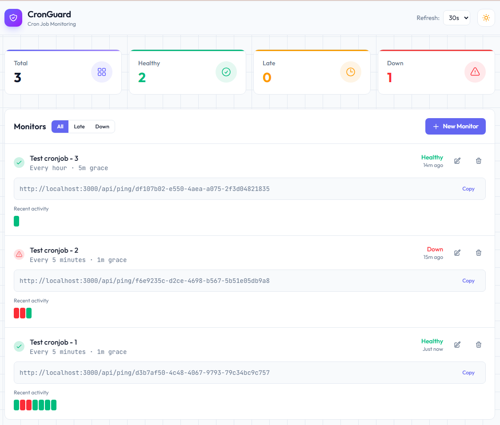
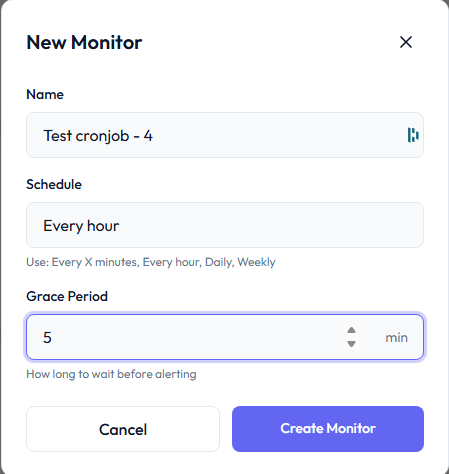

# CronGuard OSS

[](https://hub.docker.com/r/freelyit/cronguard-oss)
[](https://hub.docker.com/r/freelyit/cronguard-oss)
[](LICENSE)

A lightweight, self-hosted cron job monitoring application. CronGuard helps you monitor your scheduled tasks by receiving pings and alerting when jobs fail or run late.

<!-- SCREENSHOT: Dashboard Overview -->


## Features

- **Simple HTTP Pings** - Just add a curl/wget call to your cron jobs
- **Real-time Status** - See which jobs are healthy, late, or down
- **Grace Periods** - Configurable tolerance before marking jobs as failed
- **Pause & Maintenance Mode** - Temporarily disable monitoring during maintenance windows
- **Ping History** - Visual timeline of recent pings per monitor
- **Multi-language Support** - Code examples for 11+ programming languages
- **Self-hosted** - Your data stays on your infrastructure
- **Lightweight** - Single container with embedded SQLite database
- **Dark/Light Mode** - Beautiful UI with theme support

## Quick Start

### Using Docker Compose (Recommended)

```bash
# Download docker-compose.yml
curl -O https://raw.githubusercontent.com/jpbroeders/cronguard-oss/main/docker-compose.yml

# Start CronGuard
docker-compose up -d

# Open in browser
open http://localhost:3000
```

### Using Docker Run

```bash
docker run -d \
  --name cronguard \
  -p 3000:3000 \
  -v cronguard-data:/app/data \
  --restart unless-stopped \
  freelyit/cronguard-oss:latest
```

### Custom Port

```bash
# Using Docker Compose
PORT=8080 docker-compose up -d

# Using Docker Run
docker run -d \
  --name cronguard \
  -p 8080:8080 \
  -e PORT=8080 \
  -v cronguard-data:/app/data \
  --restart unless-stopped \
  freelyit/cronguard-oss:latest
```

## Usage

### Creating a Monitor

1. Open CronGuard in your browser (`http://localhost:3000`)
2. Click **"New Monitor"**
3. Fill in the details:
   - **Name**: A descriptive name (e.g., "Daily Backup")
   - **Schedule**: How often the job runs (e.g., "Every 5 minutes", "Every hour", "Daily")
   - **Grace Period**: How long to wait before alerting (in minutes)
4. Click **"Create Monitor"**

<!-- SCREENSHOT: Create Monitor Modal -->


### Integrating with Your Cron Jobs

After creating a monitor, you'll get a unique ping URL. Add a simple HTTP call to your cron job:

#### Basic Usage (Bash/cURL)

```bash
# Add to the end of your cron job
curl -fsS https://your-domain/api/ping/YOUR_MONITOR_ID

# Example crontab entry
0 2 * * * /path/to/backup.sh && curl -fsS https://your-domain/api/ping/abc123
```

#### Report Success or Failure

```bash
#!/bin/bash
# Run your job and report the result

if /path/to/your-script.sh; then
  curl -fsS https://your-domain/api/ping/YOUR_MONITOR_ID
else
  curl -fsS https://your-domain/api/ping/YOUR_MONITOR_ID \
    -X POST \
    -H "Content-Type: application/json" \
    -d '{"success": false, "message": "Script failed"}'
fi
```

#### With Duration Tracking

```bash
#!/bin/bash
START_TIME=$(date +%s%3N)

# Your job logic here
/path/to/your-script.sh

END_TIME=$(date +%s%3N)
DURATION=$((END_TIME - START_TIME))

curl -fsS https://your-domain/api/ping/YOUR_MONITOR_ID \
  -X POST \
  -H "Content-Type: application/json" \
  -d "{\"duration\": $DURATION}"
```

### Code Examples

CronGuard provides built-in code examples for multiple languages. Here are a few:

<details>
<summary><strong>Python</strong></summary>

```python
import requests

def main():
    # Your job logic here
    print("Running scheduled task...")

    # Ping on success
    requests.get("https://your-domain/api/ping/YOUR_MONITOR_ID")

if __name__ == "__main__":
    main()
```

</details>

<details>
<summary><strong>Node.js</strong></summary>

```javascript
// Simple ping
fetch("https://your-domain/api/ping/YOUR_MONITOR_ID");

// With error handling
async function runJob() {
  try {
    await doSomething();
    await fetch("https://your-domain/api/ping/YOUR_MONITOR_ID");
  } catch (error) {
    await fetch("https://your-domain/api/ping/YOUR_MONITOR_ID", {
      method: "POST",
      headers: { "Content-Type": "application/json" },
      body: JSON.stringify({ success: false, message: error.message })
    });
  }
}
```

</details>

<details>
<summary><strong>PowerShell</strong></summary>

```powershell
# Your job logic here
& .\backup.ps1

# Ping CronGuard
Invoke-WebRequest -Uri "https://your-domain/api/ping/YOUR_MONITOR_ID" -Method GET
```

</details>

<details>
<summary><strong>Go</strong></summary>

```go
package main

import "net/http"

func main() {
    // Your job logic here
    runJob()

    // Ping CronGuard
    http.Get("https://your-domain/api/ping/YOUR_MONITOR_ID")
}
```

</details>

<details>
<summary><strong>PHP</strong></summary>

```php
<?php
// Your job logic here
runBackup();

// Ping CronGuard
file_get_contents("https://your-domain/api/ping/YOUR_MONITOR_ID");
```

</details>

## API Reference

### Ping Endpoints

#### GET `/api/ping/{id}`

Simple ping to mark a job as successful.

```bash
curl https://your-domain/api/ping/YOUR_MONITOR_ID
```

**Response:**
```
OK
```

#### POST `/api/ping/{id}`

Detailed ping with optional metadata.

```bash
curl -X POST https://your-domain/api/ping/YOUR_MONITOR_ID \
  -H "Content-Type: application/json" \
  -d '{
    "success": true,
    "duration": 1234,
    "message": "Backup completed successfully"
  }'
```

**Request Body (all fields optional):**

| Field | Type | Description |
|-------|------|-------------|
| `success` | boolean | Whether the job succeeded (default: `true`) |
| `duration` | number | Job duration in milliseconds |
| `message` | string | Optional message (max 500 chars) |

**Response:**
```json
{
  "status": "ok",
  "ping_id": "abc123",
  "monitor": {
    "id": "your-monitor-id",
    "name": "Daily Backup",
    "status": "healthy"
  }
}
```

### Monitor Endpoints

#### GET `/api/monitors`

List all monitors.

```bash
curl https://your-domain/api/monitors
```

#### GET `/api/monitors?id={id}`

Get a specific monitor.

```bash
curl https://your-domain/api/monitors?id=YOUR_MONITOR_ID
```

#### GET `/api/monitors?stats=true`

Get monitor statistics.

```bash
curl https://your-domain/api/monitors?stats=true
```

**Response:**
```json
{
  "total": 5,
  "healthy": 3,
  "late": 1,
  "down": 1,
  "paused": 0,
  "totalPings": 1234
}
```

#### POST `/api/monitors`

Create a new monitor.

```bash
curl -X POST https://your-domain/api/monitors \
  -H "Content-Type: application/json" \
  -d '{
    "name": "Daily Backup",
    "schedule": "Daily",
    "graceMinutes": 30
  }'
```

**Request Body:**

| Field | Type | Required | Description |
|-------|------|----------|-------------|
| `name` | string | Yes | Monitor name (max 100 chars) |
| `schedule` | string | Yes | Schedule pattern (see below) |
| `graceMinutes` | number | No | Grace period in minutes (default: 15) |

**Supported Schedule Patterns:**
- `Every 5 minutes`, `Every 15 minutes`, etc.
- `Every hour`
- `Daily`
- `Weekly`

#### PATCH `/api/monitors`

Update an existing monitor.

```bash
curl -X PATCH https://your-domain/api/monitors \
  -H "Content-Type: application/json" \
  -d '{
    "id": "YOUR_MONITOR_ID",
    "name": "Updated Name",
    "graceMinutes": 60
  }'
```

#### DELETE `/api/monitors?id={id}`

Delete a monitor.

```bash
curl -X DELETE https://your-domain/api/monitors?id=YOUR_MONITOR_ID
```

### Pause & Resume Endpoints

#### POST `/api/pause`

Pause a monitor to temporarily disable alerting (e.g., during maintenance).

```bash
curl -X POST https://your-domain/api/pause \
  -H "Content-Type: application/json" \
  -d '{
    "id": "YOUR_MONITOR_ID",
    "reason": "Scheduled maintenance",
    "until": "2024-01-15T10:00:00Z"
  }'
```

**Request Body:**

| Field | Type | Required | Description |
|-------|------|----------|-------------|
| `id` | string (UUID) | Yes | Monitor ID |
| `reason` | string | No | Reason for pausing |
| `until` | string (ISO 8601) | No | Auto-resume time (omit for indefinite pause) |

#### POST `/api/resume`

Resume a paused monitor.

```bash
curl -X POST https://your-domain/api/resume \
  -H "Content-Type: application/json" \
  -d '{"id": "YOUR_MONITOR_ID"}'
```

## Rate Limiting

The ping endpoints are rate-limited to **5 requests per minute per monitor** to prevent abuse. If you exceed this limit, you'll receive a `429 Too Many Requests` response with a `Retry-After` header.

## Monitor Status

CronGuard calculates monitor status dynamically based on the last ping:

| Status | Description |
|--------|-------------|
| **Healthy** | Last ping received within expected interval |
| **Late** | Ping overdue but within grace period |
| **Down** | Ping overdue beyond grace period |
| **Paused** | Monitoring temporarily disabled (no alerts) |

## Data Persistence

CronGuard stores all data in a SQLite database at `/app/data/cronguard.db`. To persist data across container restarts:

```bash
# Using a named volume (recommended)
-v cronguard-data:/app/data

# Using a host directory
-v /path/on/host:/app/data
```

## Configuration

| Environment Variable | Default | Description |
|---------------------|---------|-------------|
| `PORT` | `3000` | Application port |
| `NODE_ENV` | `production` | Node.js environment |

## Development

### Prerequisites

- Node.js 24+ (LTS)
- npm

### Local Development

```bash
# Clone the repository
git clone https://github.com/jpbroeders/cronguard-oss.git
cd cronguard-oss

# Install dependencies
npm install

# Start development server
npm run dev

# Open http://localhost:3000
```

### Build from Source

```bash
# Build the Docker image locally
docker build -t cronguard-oss .

# Run the locally built image
docker run -d -p 3000:3000 -v cronguard-data:/app/data cronguard-oss
```

## Tech Stack

- **Next.js 16** with App Router
- **React 19** with TypeScript
- **Tailwind CSS 4** for styling
- **SQLite** with better-sqlite3 (WAL mode)

## Contributing

Contributions are welcome! Please feel free to submit a Pull Request.

## License

This project is open source and available under the [MIT License](LICENSE).

## Support

- **GitHub Issues**: [Report a bug or request a feature](https://github.com/jpbroeders/cronguard-oss/issues)
- **Docker Hub**: [freelyit/cronguard-oss](https://hub.docker.com/r/freelyit/cronguard-oss)

---

Made with care by [FreelyIT](https://github.com/jpbroeders)
